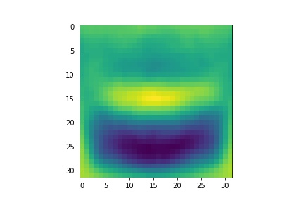
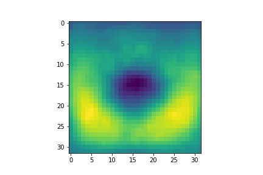
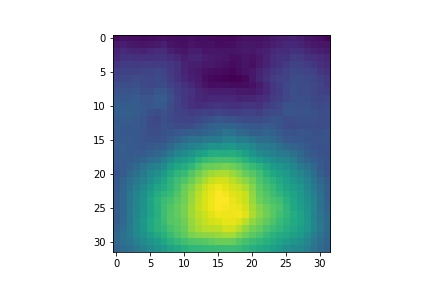
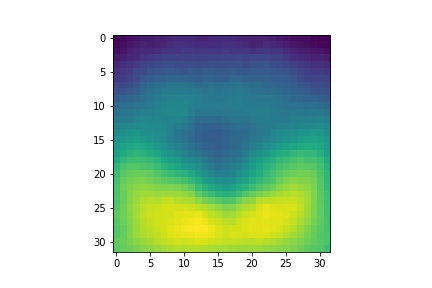
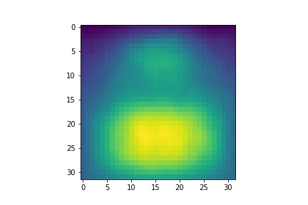
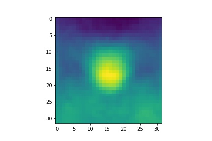
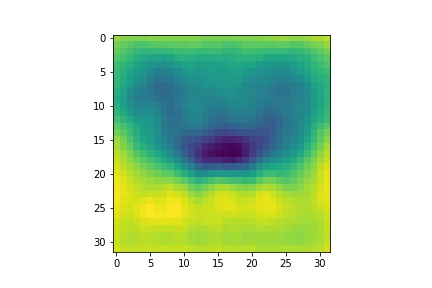
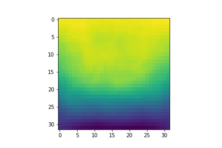
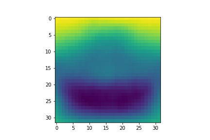

# Children-Height-CIFAR10-classfication
Machine Learning Exercise Creating a Linear Classify with Gradient Descent from Scratch

## Image Template of 10 Learned Weight Vectors
Class 1

Class 2 

Class 3
 
Class 4

Class 5
 
 Class 6
  
 Class 7
  
 Class 8
 
 Class 9
 
