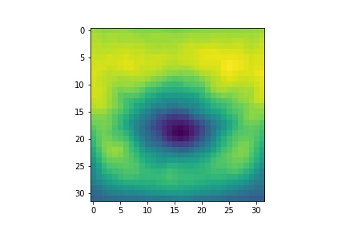

# Children-Height-CIFAR10-classfication
Machine Learning Exercise Creating a Linear Classify with Gradient Descent from Scratch

## Image Template of 10 Learned Weight Vectors From Class 0-9
    
  

 

